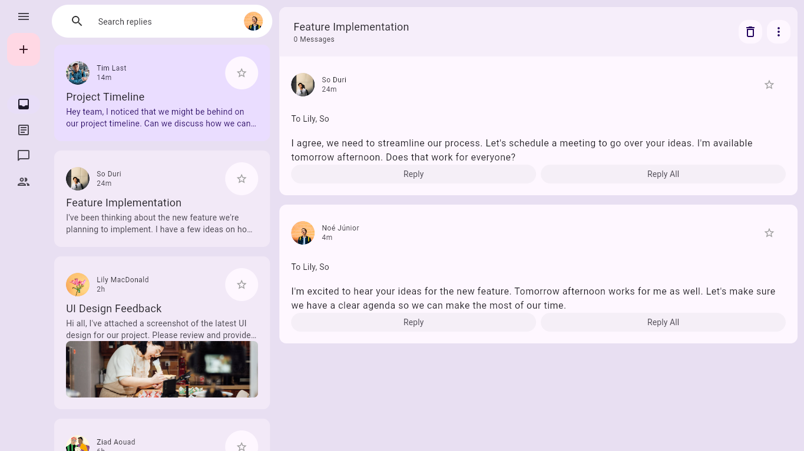
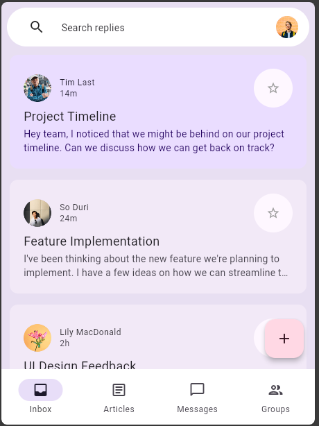

# animatedResponsiveLayout 🔥




## Overview ✨

`animatedResponsiveLayout` is a study project focused on creating an animated and responsive layout using Flutter and Dart. The main goal of this project is to explore and understand various techniques for building responsive user interfaces that adapt to different screen sizes and orientations.

## Features 🦾

- Responsive design that adapts to various screen sizes
- Smooth animations for a better user experience
- Clean and maintainable code structure
- Utilization of Flutter's powerful layout and animation capabilities

## Getting Started

To get a local copy up and running follow these simple steps.

### Prerequisites

- Flutter SDK: [Install Flutter](https://flutter.dev/docs/get-started/install)
- Dart SDK: [Install Dart](https://dart.dev/get-dart)

### Installation

1. Clone the repository:
    ```sh
    git clone https://github.com/noejunior792/animatedResponsiveLayout.git
    ```
2. Navigate to the project directory:
    ```sh
    cd animatedResponsiveLayout
    ```
3. Install dependencies:
    ```sh
    flutter pub get
    ```
4. Run the app:
    ```sh
    flutter run
    ```

## Usage

Use this project to understand how to build responsive layouts in Flutter. The code is structured to be easy to read and modify, allowing you to experiment with different layout and animation techniques.

## Contributing 🤼‍♂️

Contributions are what make the open-source community such an amazing place to learn, inspire, and create. Any contributions you make are **greatly appreciated**.

1. Fork the Project
2. Create your Feature Branch (`git checkout -b feature/AmazingFeature`)
3. Commit your Changes (`git commit -m 'Add some AmazingFeature'`)
4. Push to the Branch (`git push origin feature/AmazingFeature`)
5. Open a Pull Request


## Contact

Noé Júnior - [noedombaxe@gmail.com](noedombaxe@gmail.com)

Project Link: [https://github.com/noejunior792/animatedResponsiveLayout](https://github.com/noejunior792/animatedResponsiveLayout)
